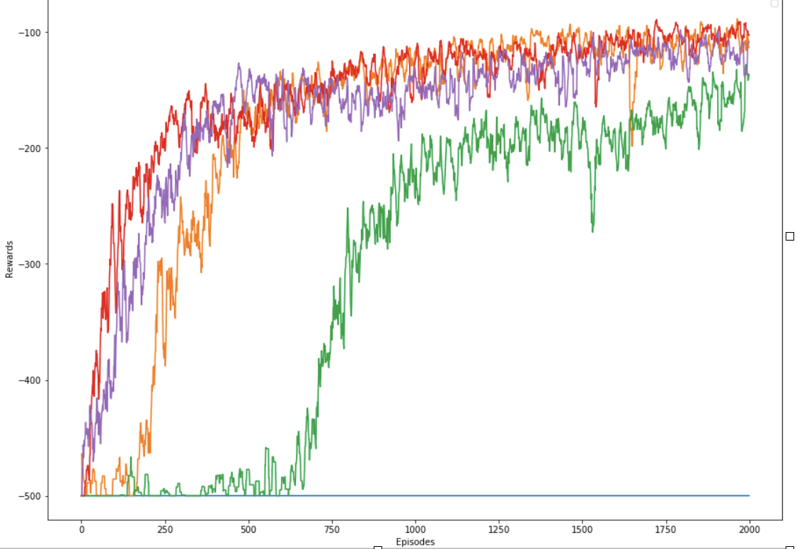
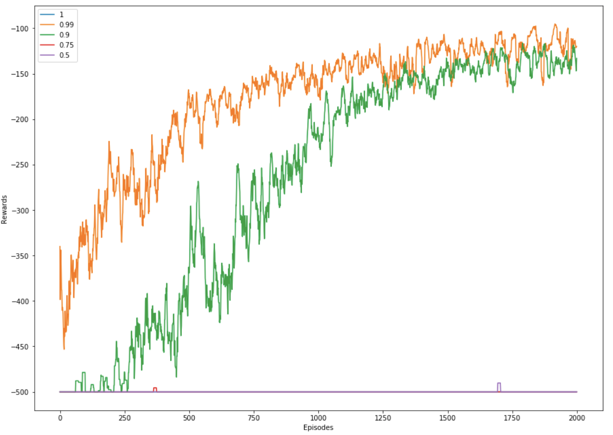
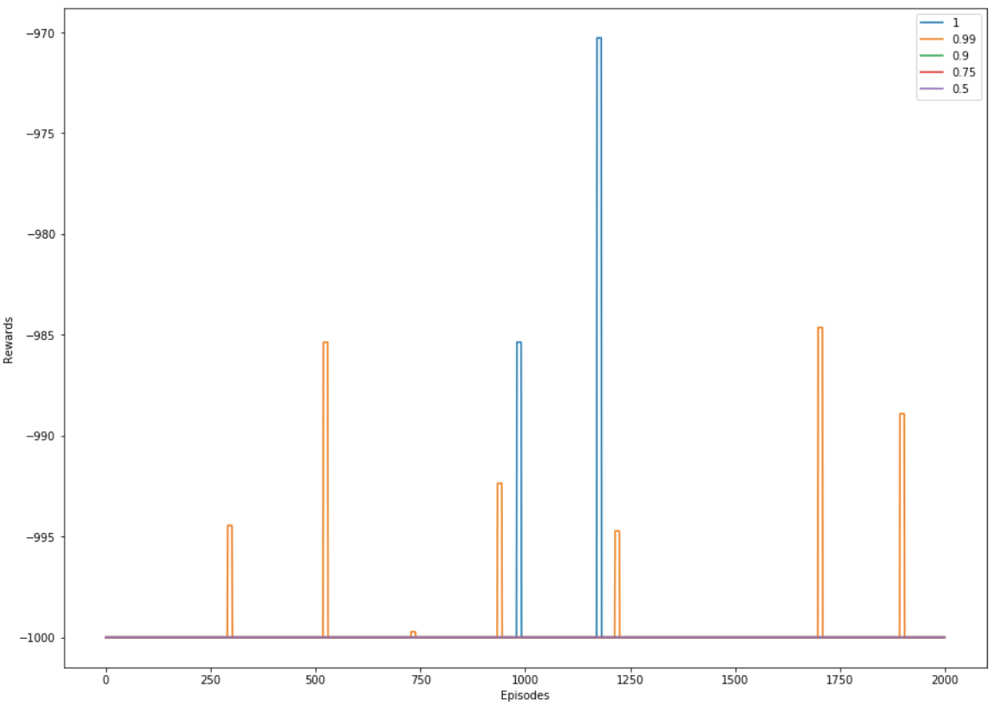
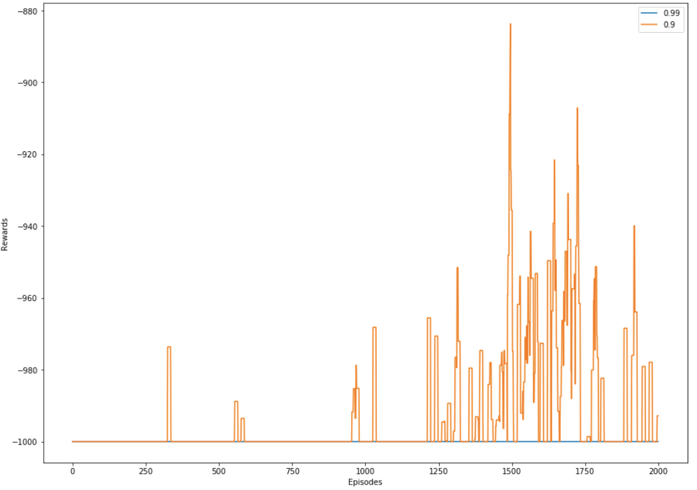

# Learning optimal policies in an MDP environment

## About:
The purpose of this project was to find optimal or near-optimal solutions to solve problems in complex environments.

In this project, a custom Maze problem needs to be solved in which there are certain flags in the maze which are to be collected and the goal is to reach the end of maze. Another part of this project is to solve OpenAI Gym environment problems, like MountainCar-v0 and Acrobot-v1.

- Python 3.6

### What is reinforcement learning?

## Model:

### REINFORCE
## Results:

### model design:
- layers: 1
- Nodes: 16
- Optimizer: Adam
- Activation: ReLU
- REINFORCE with Baseline (sliding window of 10 episodes)

### graphs:
For acrobot and MountainCar, each time step  results in a negative reward.
- x-axis: episodes: 2000 episode limit
- yaxis: reward, time-step clipped
#### REINFORCE under multiple initializations on Acrobot-v1

This result shows 5 randomly seelcted seed values with a discounting value (gamma) of 0.99. This result demonstrates the high variance problem with REINFORCE at different intiializations. Despite so, 4/5 times
#### REINFORCE with discounting on Acrobot-v1

#### REINFORCE with discounting on MountainCar-v0

#### REINFORCE with reward haping on MountainCar-v0

## How to run
For acrobot, first run following:
QL.py --acrobot --optimal
followed by following to see evaluation
QL.py --acrobot

usage: QL.py [-h] [--car] [--maze] [--acrobot]

Choose the environment we are working with

optional arguments:
  -h, --help  show this help message and exit
  --car       Choose the MountainCar gym environment
  --maze      Choose the Maze environment
  --acrobot   Choose the Acrobat environment
## References
ECE 5242: Intelligent Autonomous Systems, taught by Dr. Dan Lee
