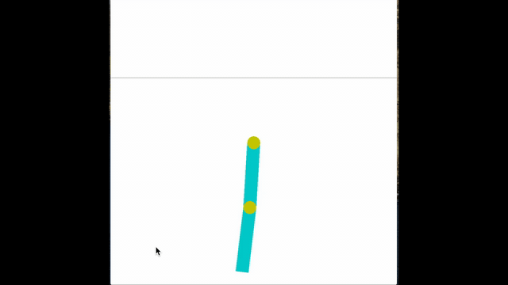

# Learning optimal policies in an MDP environment

## About:
The purpose of this project was to find optimal or near-optimal solutions to solve problems in complex environments.

In this project, a custom Maze problem needs to be solved in which there are certain flags in the maze which are to be collected and the goal is to reach the end of maze. Another part of this project is to solve OpenAI Gym environment problems, like MountainCar-v0 and Acrobot-v1.

- Python 3.6
- NumPy 1.17.4
- PyTorch 1.4.0

## What is reinforcement learning?
Reinforcement learning, or RL, describes learning based on numerical reward signals.
### Markov decision process 

Described as a tuple <S, A, T, γ, R> 
- S, a finite set of states
- A, an agent’s finite set of actions
- T, state transition probabilities: P(s’|s,a)
- γ, Discount value [0-1]
- R, the reward model: R(s,a)

## Simulations:
### Maze:
  - 112 states
  - 4 actions (up, down, left, right)
  - goal: capture 3 flags, and reach goal space with the most amount of flag captured
### Acrobot
  - 6 continuous state vectors [cos(theta1) sin(theta1) cos(theta2) sin(theta2) thetaDot1 thetaDot2]
  - 3 discrete actions (+ torque, - torque, 0 torque)
  - goal: have the end-effector reach a line over the acrobot
### MountainCar
  - 2 continuous state vectors (position, velocity)
  - 3 discrete actions (+ acceleration, - acceleration, 0 acceleration)
  - goal: reach the top of a hill

## Model:

### REINFORCE
## Results:

### model design:
- layers: 1
- Nodes: 16
- Optimizer: Adam
- Activation: ReLU
- REINFORCE with Baseline (sliding window of 10 episodes)

### graphs:
For acrobot and MountainCar, each time step  results in a negative reward.
- x-axis: episodes: 2000 episode limit
- yaxis: reward based on time-step clipped to a certain value
#### REINFORCE under multiple initializations on Acrobot-v1

This result shows 5 randomly seelcted seed values with a discounting value (gamma) of 0.99. This result demonstrates the high variance problem with REINFORCE at different intiializations. Despite so, 4/5 times the initializations lead to near optimal convergence
#### REINFORCE with discounting on Acrobot-v1

This result shows varying discounting rates on a single initialization seed. We can see that with this unit interval, that have a value of 1 or 0.5 does not converge, but rather, a value in the middle. The value that is typically used in literature is between 0.9 and 0.99, which both approached convergence to a near optimal value
#### REINFORCE with discounting on MountainCar-v0

mountainCar is a difficult problem with vanilla REINFORCE, because of it is a sparse environment, meaning that a reward is only given if the goal is completed, meaning that the agent has to sample a large continuous state space.
#### REINFORCE with reward haping on MountainCar-v0

In this result, Reward Shaping was utilized on the same initialization. This method updates the reward function based on an normalized absolute value of the observation values R' = R + (abs(observation vector / max value)). This update improves exploration of the agent by giving it a sub-goal, which improves its chances of reaching the real goal. improved the result near the end of the episode iteration, but did not ultimately converge to an optimal value. 

## How to run

### Q-Learning

#### Maze
  'VI.py --maze --optimal'
  'QL.py --maze'
#### Gym environments
  'QL.py --acrobot' Optimal q-table is already generated and included
#### All environments available
- Maze '--maze'
- Acrobot '--acrobot'
- MountainCar '--car'
#### Other options
- Optimal: Generate optimal q-table
- save: Save plot that is generated
- render: renders episode at intervals based on EPISODE_EVALUATION variable
### REINFORCE
#### Gym environments
  'reinforce.py --acrobot --baseline --render'
#### All environments available
- MountainCar
- Cartpole
- Acrobot
#### Other command options
- baseline: Add baseline, which creates sliding window of 10 episode rewards. Improves learning convergence
- render: renders episode at intervals based on EPISODE_EVALUATION variable
 
## For more guidance on running, include '--help' on command line for programs

## References
- ECE 5242: Intelligent Autonomous Systems, taught by Dr. Dan Lee
- Reinforcement Learning: An Introduction, Sutton, R & Barto, A
